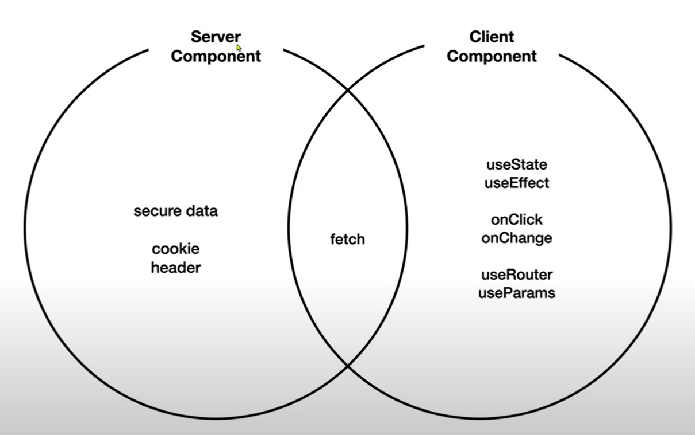
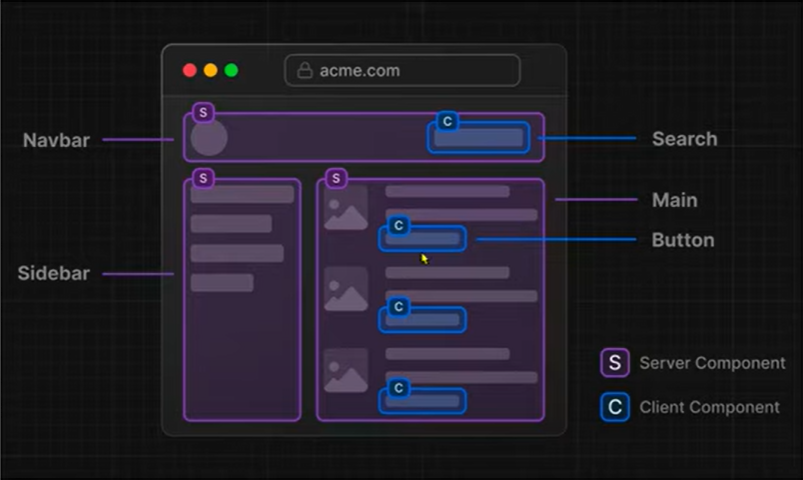

next.js에는 Server Component와 Client Component로 구분됨(react거 가져온거임)

Next.js는 특별한 조치를 하지 않으면 ServerComponent로 인식함

사용자와 상호작용하는 저 버튼만 새로운 컴포넌트로 만들어서 ClientComponent로 만드는게 유리하다

ServerComponent 단순히 보여주는 것
ClientComponent 사용자와 상호작용
